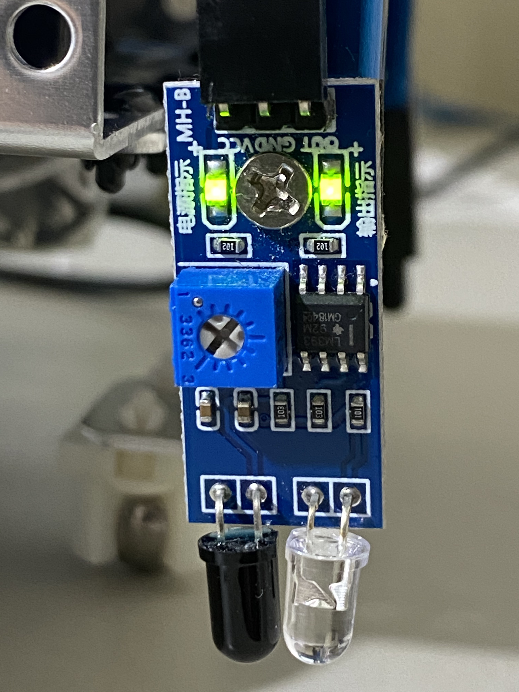

# 9循跡車
### 
### 紅外線校對
  


```c++
//紅外線校對
//循跡車
//人面對背面方向
//D1插孔 - 紅外線左模組
//D2插孔- 紅外線右模組

//白色-0
//黑色-1
#define irLeft 2
#define irRight 3

void setup() {
  // put your setup code here, to run once:
  Serial.begin(9600);
}

void loop() {
  // put your main code here, to run repeatedly:
  int leftValue = digitalRead(irLeft);
  int rightValue = digitalRead(irRight);
  Serial.print("left:");
  Serial.println(leftValue);
  Serial.print("right:");
  Serial.println(rightValue);
  delay(500);
}
```

### 循跡車
[循跡車](https://youtu.be/Y316hPo1ZcU)

```c++
//循跡車
//人面對背面方向
//D1插孔 - 紅外線左模組
//D2插孔- 紅外線右模組

//白色-0
//黑色-1
#include <MatrixMini.h>
#include <Thread.h>

MatrixMini Mini;
Thread myThread = Thread();
//馬達會影響D1,D2
#define irLeft 2
#define irRight 3

void setup() {
  Mini.begin();
  myThread.onRun(detect);
  myThread.setInterval(50);  
  Serial.begin(9600);
  pinMode(irLeft, INPUT);
  pinMode(irRight, INPUT);
}

void loop() {
  if(myThread.shouldRun()){
    myThread.run();
  }
  delay(1);

}

void detect(){
  int leftValue = digitalRead(irLeft);
  int rightValue = digitalRead(irRight);
  Serial.print("leftValue:");
  Serial.println(leftValue);
  Serial.print("rightValue:");
  Serial.println(rightValue);
  int speed = 50;
  int g = 20;
  if(leftValue == 0 && rightValue == 0){
    //直線
    running(speed, speed);
    Serial.println("直線");
  }else if(leftValue == 0 && rightValue == 1){
    //右轉
    running(speed, speed-g);
    Serial.println("右轉");
  }else if(leftValue == 1 && rightValue == 0){
    //左轉
    running(speed-g, speed);
    Serial.println("左轉");
  }else{
    //停止
    running(0, 0);
    Serial.println("停止");
  }
}

void running(int leftMotor, int rightMotor){
  //M1 = 左輪
  //M2 = 右輪
  Mini.M1.set(leftMotor);
  Mini.M2.set(rightMotor);
}
```

### 找尋出路的小車

[受困的小車](https://youtu.be/RA1Zy24_muo)

[找尋出路的小車](https://youtu.be/f0zaeLrmeyI)

```c++
//循跡車-找尋出路的小車
//人面對背面方向
//D1插孔 - 紅外線左模組
//D2插孔- 紅外線右模組

//白色-0
//黑色-1
#include <MatrixMini.h>
#include <Thread.h>

MatrixMini Mini;
Thread myThread = Thread();
//馬達會影響D1,D2
#define irLeft 2
#define irRight 3

void setup() {
  Mini.begin();
  myThread.onRun(detect);
  myThread.setInterval(10); 
  randomSeed(analogRead(4));
  Serial.begin(9600);
  pinMode(irLeft, INPUT);
  pinMode(irRight, INPUT);
}

void loop() {
  if(myThread.shouldRun()){
    myThread.run();
  }
 }

void detect(){
  int leftValue = digitalRead(irLeft);
  int rightValue = digitalRead(irRight);
  Serial.print("leftValue:");
  Serial.println(leftValue);
  Serial.print("rightValue:");
  Serial.println(rightValue);
  int speed = 50;
  
  if(leftValue == 0 && rightValue == 0){
    //直線
    running(speed, speed);
    Serial.println("直線");  
  }else{
    //後退,旋轉
    back(100, 50);
    Serial.println("停止");
  }
}

void running(int leftMotor, int rightMotor){
  //M1 = 左輪
  //M2 = 右輪
  Mini.M1.set(leftMotor);
  Mini.M2.set(rightMotor);
}

void back(int backSpeed, int trunSpeed){
  Mini.M1.set(-backSpeed);
  Mini.M2.set(-backSpeed);
  delay(500);
  long turnTime = random(500,1000);
  switch(turnTime % 2){
    case 0:
      //右旋轉
      Mini.M1.set(trunSpeed);
      Mini.M2.set(-trunSpeed);
      break;
    case 1:
     //左旋轉
     Mini.M1.set(-trunSpeed);
     Mini.M2.set(trunSpeed);
     break;
  }
  delay(turnTime);  
}
```
